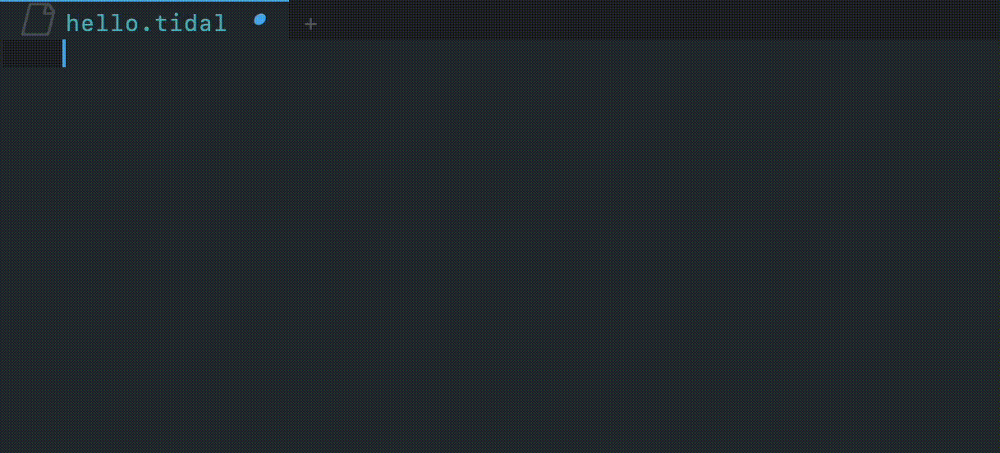

# company-tidal
Emacs `company-mode` completion backend for [TidalCycles](https://tidalcycles.org/).



## Install

Add `company-tidal.el` to your load path.

``` emacs-lisp
(add-to-list 'load-path "path/to/company-tidal.el")
```

Add `company-tidal` to `company-backends`.

``` emacs-lisp
(add-to-list 'company-backends 'company-tidal)
```
